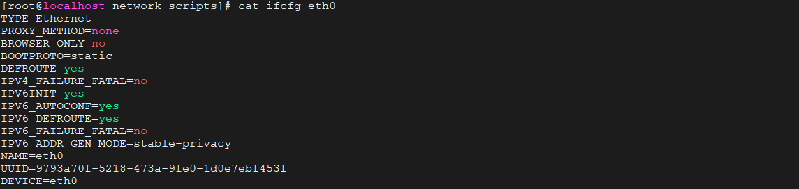
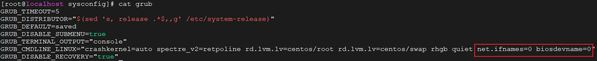
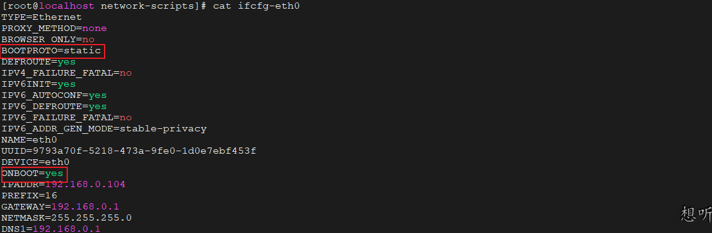

## 设置默认网卡名称


系统安装结束后查看当前网卡名称为ens33。

- 编辑网卡的配置文件：

 在路径 “/etc/sysconfig/network-scripts/” 找到文件 ifcfg-ens33,将文件中的NAME和DEVICE参数修改为eth0，并且将网卡配置文件ifcfg-ens33修改为ifcfg-eth0 （mv ifcfg-ens33 ifcfg-eth0）。
 
 修改后的结果如下图所示：

 

- 修改grub配置文件来禁用

 在路径“/etc/sysconfig/” 找到grub文件，在GRUB_CMDLINE_LINUX变量的引号里面后面添加 “net.ifnames=0 biosdevname=0”。

 

- 重新生成grub配置并更新内核参数，运行命令：grub2-mkconfig -o /boot/grub2/grub.cfg。

- 重启系统后验证。


## 设置静态IP

dhcp 网络模式会在联网之后自动获取到IP地址，dhcp 获取的ip地址可能会因为网络重连发生变化，实际网络中，我们希望自己的IP地址是唯一的，以便于通过IP进行通讯访问，采用配置静态IP方式是最好的一种方式，静态IP配置方式

还是上面路径，找到ifcfg-eth0(我们已经修改的文件名，之前文件名为ifcfg-ens33)，打开进行编辑，添加一下内容：

```
BOOTPROTO=static #默认dhcp,改为static,表示启用静态IP地址

ONBOOT=yes #开启自动启用网络连接

IPADDR=192.168.0.104 #静态IP地址，如果使用虚拟机桥接模式，静态IP一定要和主机在同一个网段，且IP唯一未被使用

GATEWAY=192.168.0.1 #网关，需和公网主机配置的网关一致

NETMASK=255.255.255.0 #子网掩码，需和公网主机配置的网关一致

DNS1=192.168.0.1 #第一个dns服务器，BOOTPROTO=static 的时候不会自动生成DNS解析，最好在这里也一并配置上
```

修改后的结果如下图所示：




